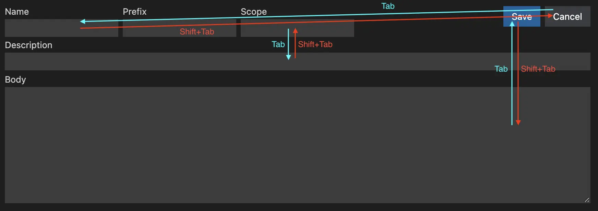

[![jsdelivr][jsdelivr-badge]][jsdelivr-link]
[![npm version][fury-badge]][fury-link]
[![codecov][codecov-badge]][codecov-link]

# [tab-goto][tab-goto]

Control where `tab` or `shift+tab` goto .



## Installation

npm:

```sh
npm install tab-goto
```

Yarn:

```sh
yarn add tab-goto
```

## Usage

You can set any CSS Selector to `tab-goto` or `shift-tab-goto` attribute to control where `tab` or `shift+tab` goto. We use [`querySelector()`](https://developer.mozilla.org/en-US/docs/Web/API/Document/querySelector) internally to find the element to focus.

CDN:

```html
<script src="https://cdn.jsdelivr.net/npm/tab-goto@0.1.1"></script>

<input class="my-input" tab-goto="#my-div" />
<button my-button tab-goto=".my-input" shift-tab-goto='[my-data="div1"]'>
  my button
</button>
<div id="my-div" my-data="div1" tab-goto="[my-button]" tabindex="0">my-div</div>
```

ESM:

```js
import "tab-goto";
```

## API

### `config(options)`

The `config()` method is used to configure tab goto uses attribute names and enable/disable tab goto.

#### Example

CDN:

```html
<input class="my-input" my-tab-goto="#my-div" />
<button my-button my-tab-goto=".my-input" my-shift-tab-goto='[my-data="div1"]'>
  my button
</button>
<div id="my-div" my-data="div1" my-tab-goto="[my-button]" tabindex="0">
  my-div
</div>

<script src="https://cdn.jsdelivr.net/npm/tab-goto@0.1.1"></script>
<script>
  window.tabGoto.config({
    tabGotoName: "my-tab-goto",
    shiftTabGotoName: "my-shift-tab-goto",
    enableTabGoto: true,
    enableShiftTabGoto: true,
  });
</script>
```

ESM:

```js
import { config as configTabGoto } from "tab-goto";

configTabGoto({
  tabGotoName: "my-tab-goto",
  shiftTabGotoName: "my-shift-tab-goto",
  enableTabGoto: true,
  enableShiftTabGoto: true,
});
```

#### Parameters

- `options` (`Object`) - The options object.
  - `tabGotoName` (`string`) - The attribute name of tab goto. Default: `tab-goto`.
  - `shiftTabGotoName` (`string`) - The attribute name of shift tab goto. Default: `shift-tab-goto`.
  - `enableTabGoto` (`boolean`) - Whether enable tab goto. Default: `true`.
  - `enableShiftTabGoto` (`boolean`) - Whether enable shift tab goto. Default: `true`.

## [Release Notes](./CHANGELOG.md)

<!-- Definitions -->

[tab-goto]: https://zjffun.github.io/tab-goto/
[fury-link]: https://badge.fury.io/js/tab-goto
[fury-badge]: https://badge.fury.io/js/tab-goto.svg
[jsdelivr-link]: https://www.jsdelivr.com/package/npm/tab-goto
[jsdelivr-badge]: https://data.jsdelivr.com/v1/package/npm/tab-goto/badge
[codecov-badge]: https://codecov.io/gh/zjffun/tab-goto/branch/main/graph/badge.svg
[codecov-link]: https://codecov.io/gh/zjffun/tab-goto
