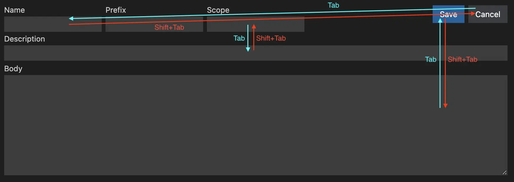

[![jsdelivr][jsdelivr-badge]][jsdelivr-link]
[![npm version][fury-badge]][fury-link]
[![codecov][codecov-badge]][codecov-link]

# [tab-goto][tab-goto]

[English](./README.md) | 简体中文

控制按下 `Tab` 或 `Shift+Tab` 后聚焦的元素。



## 安装

npm:

```sh
npm install tab-goto
```

Yarn:

```sh
yarn add tab-goto
```

## 使用

你可以为 `tab-goto` 或 `shift-tab-goto` 属性设置任何 CSS 选择器来控制按下 `Tab` 或者 `Shift+Tab` 后聚焦的元素。我们内部会使用 [`querySelector()`](https://developer.mozilla.org/en-US/docs/Web/API/Document/querySelector) 寻找要聚焦的元素。

CDN:

```html
<script src="https://cdn.jsdelivr.net/npm/tab-goto@0.1.1"></script>

<input class="my-input" tab-goto="#my-div" />
<button my-button tab-goto=".my-input" shift-tab-goto='[my-data="div1"]'>
  my button
</button>
<div id="my-div" my-data="div1" tab-goto="[my-button]" tabindex="0">my-div</div>
```

ESM:

```js
import "tab-goto";
```

## API

### `config(options)`

`config()` 函数用来配置 tab goto 使用的属性名和启用/禁用聚焦到设置的元素。

#### 例子

CDN:

```html
<input class="my-input" my-tab-goto="#my-div" />
<button my-button my-tab-goto=".my-input" my-shift-tab-goto='[my-data="div1"]'>
  my button
</button>
<div id="my-div" my-data="div1" my-tab-goto="[my-button]" tabindex="0">
  my-div
</div>

<script src="https://cdn.jsdelivr.net/npm/tab-goto@0.1.1"></script>
<script>
  window.tabGoto.config({
    tabGotoName: "my-tab-goto",
    shiftTabGotoName: "my-shift-tab-goto",
    enableTabGoto: true,
    enableShiftTabGoto: true,
  });
</script>
```

ESM:

```js
import { config as configTabGoto } from "tab-goto";

configTabGoto({
  tabGotoName: "my-tab-goto",
  shiftTabGotoName: "my-shift-tab-goto",
  enableTabGoto: true,
  enableShiftTabGoto: true,
});
```

#### 参数

- `options` (`Object`) - 选项对象。
  - `tabGotoName` (`string`) - 按下 `Tab` 读取的属性的名称。默认值：`tab-goto`。
  - `shiftTabGotoName` (`string`) - 按下 `Shift+Tab` 读取的属性的名称。默认值: `shift-tab-goto`。
  - `enableTabGoto` (`boolean`) - 是否启用按下 `Tab` 聚焦到设置的元素。默认值: `true`。
  - `enableShiftTabGoto` (`boolean`) - 是否启用按下 `Shift+Tab` 聚焦到设置的元素。默认值: `true`。

## [更新日志](./CHANGELOG.md)

<!-- Definitions -->

[tab-goto]: https://zjffun.github.io/tab-goto/
[fury-link]: https://badge.fury.io/js/tab-goto
[fury-badge]: https://badge.fury.io/js/tab-goto.svg
[jsdelivr-link]: https://www.jsdelivr.com/package/npm/tab-goto
[jsdelivr-badge]: https://data.jsdelivr.com/v1/package/npm/tab-goto/badge
[codecov-badge]: https://codecov.io/gh/zjffun/tab-goto/branch/main/graph/badge.svg
[codecov-link]: https://codecov.io/gh/zjffun/tab-goto
